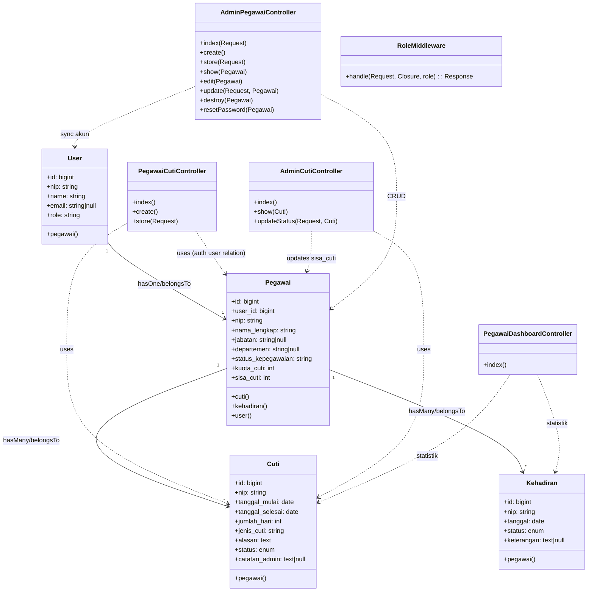

# Class Diagram SIMPEG (Versi Implementasi Saat Ini)

Berikut class diagram level implementasi (domain + application layer utama) berdasarkan kode yang ada di proyek.

## Catatan
- Diagram ini menekankan kelas yang paling relevan dengan modul kepegawaian, cuti, dan kehadiran.
- `nip` adalah business key unik, sementara relasi teknis antartabel saat ini menggunakan `id`, `user_id`, dan `nip`.
- Komponen notifikasi email dikirim dari controller menggunakan `Mail` facade dengan template Blade HTML.
