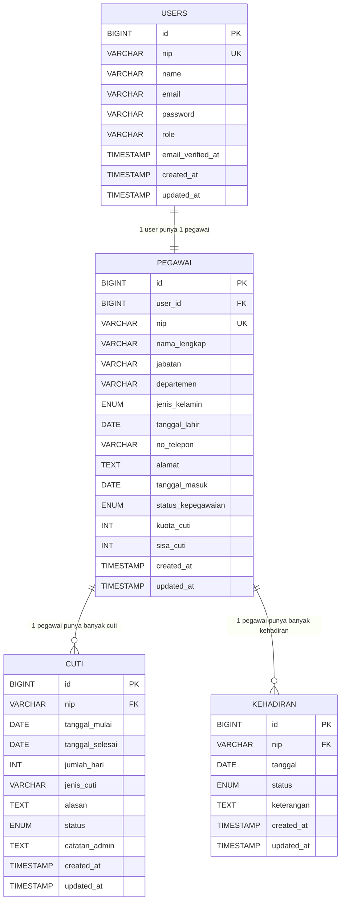

# ERD SIMPEG (Versi Implementasi Saat Ini)

Berikut ERD berdasarkan struktur migration yang saat ini digunakan di proyek.

## Catatan Relasi

- `pegawai.user_id` mereferensikan `users.id`.
- `cuti.nip` mereferensikan `pegawai.nip`.
- `kehadiran.nip` mereferensikan `pegawai.nip`.
- `users.nip` dan `pegawai.nip` sama-sama bernilai unik (business key), tetapi PK teknis tetap `id`.
